#  Table of content
+ [GENERAL ARCHITECTURE](#1)
  + [A. FROG-UI](#2)
  + [B. WYREST](#3)
  + [C. MIDDLEWARE](#4)
    + [1. MW-PVR](#5)
        + [SRS](#6)
        + [MEDIARENDERER2](#7)
        + [WYPLAYER](#8)
        + [WYCAS](#9)
    + [2. MW-SYSTEM-MANAGEMENT](#10)
        + [wystorage](#11)
        + [platformd-wyclock](#12)
        + [network manager](#13)
        + [wystandby](#14)
    + [3. MW-CONTENT-HANDLING](#15)
        + [cds-pvr](#16)
        + [downloader](#17)
        + [wyscan](#18)
    + [4. MW-PLATFORM-ADAPTATION](#19)
        + [avio](#20)
        + [wyrender](#21)
        + [wydvb](#22)
    + [5. MW-OTHER](#23)
        + [config-store](#24)
        + [wylog](#25)
        + [wytransport](#26)
#  GENERAL ARCHITECTURE ([&#8632;](#0))

[General architecture](https://portal.frogbywyplay.com/docs/wytv/featured/arch_diagram/) 
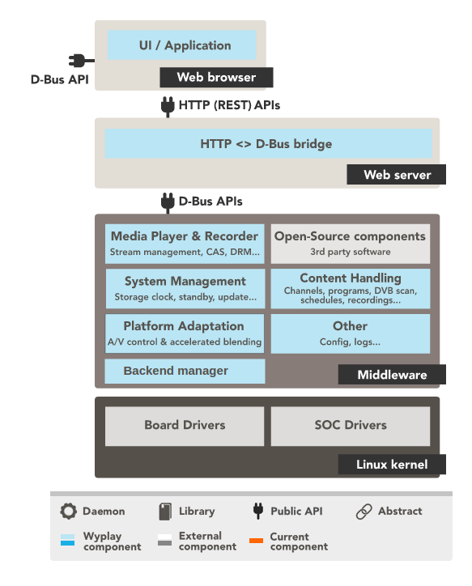 

**SOFTWARE LAYER COMMUNICATION**
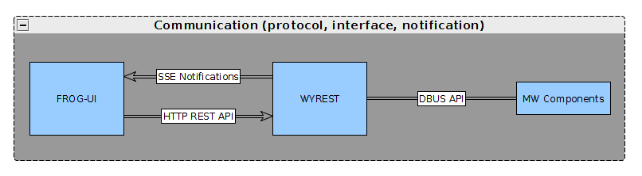 

- Wyrest uses a notification mechanism defined  [here](https://portal.frogbywyplay.com/docs/wytv/featured/components/appframeworks-wyrest/wyrest/http/routes/#get--events-) to notify events to applications via  [SSE](https://developer.mozilla.org/en-US/docs/Web/API/Server-sent_events/Using_server-sent_events) (Server-Sent Event) 

- HTTP routes provided by Wyrest are listed [here](https://portal.frogbywyplay.com/docs/wytv/featured/components/appframeworks-wyrest/wyrest/http/routes/) 

- List of methods implemented by middleware components and exposes through DBus API : [interfaces](https://portal.frogbywyplay.com/docs/wytv/featured/toc-interfaces/) 

##  A. FROG-UI ([&#8632;](#0))
[OVERVIEW](https://portal.frogbywyplay.com/docs/wytv/featured/components/apps-frog-ui/overview/) 
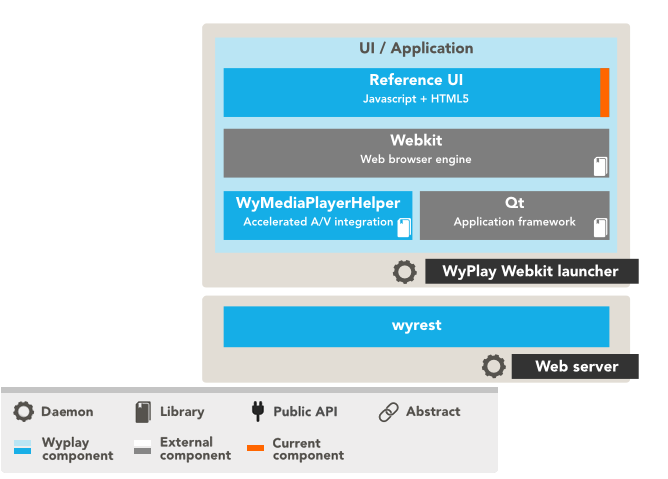 

##  B. WYREST ([&#8632;](#0))
wyrest is a RESTful API, it exposes all the middleware functionalities through HTTP and communicates with middleware component through the D-Bus API.

[Code, Présentation, Fonctionnalités, Howto, Références ](https://portal.frogbywyplay.com/docs/wytv/featured/components/appframeworks-wyrest/overview/) 

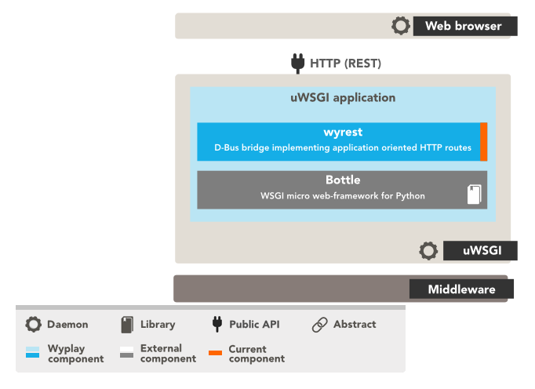 

##  C. MIDDLEWARE ([&#8632;](#0))
###  1. MW-PVR ([&#8632;](#0))
[All components](https://portal.frogbywyplay.com/docs/wytv/featured/components/toc-media/) 

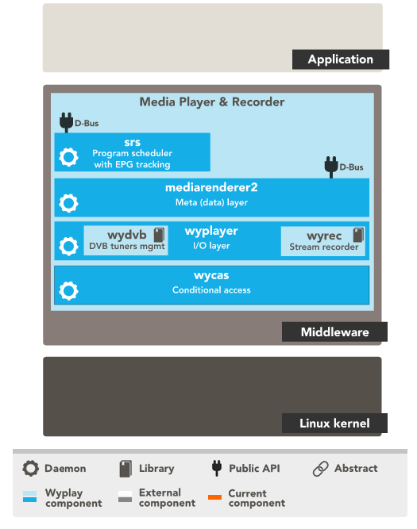 

#####  SRS ([&#8632;](#0))
[SRS](https://portal.frogbywyplay.com/docs/wytv/featured/components/media-srs/overview/)  :  Scheduled Recording Service, respecte la norme UPnP SRS. Expose API over D-Bus not over network

Flexible architecture to support evolutions > ==TO BE VERIFIED==
	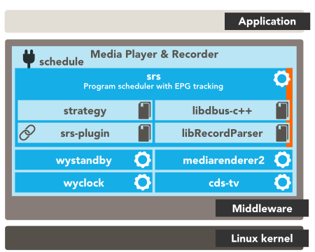 

[cds-tv](https://portal.frogbywyplay.com/docs/wytv/featured/components/contents-cds-tv/overview/#cds-tv) : EPG provider component : process DVB Service information tables and provides list of channels

[strategy](https://portal.frogbywyplay.com/docs/wytv/featured/components/media-strategy/overview/#strategy) : resolve conflicts btw recordings

#####  MEDIARENDERER2 ([&#8632;](#0))
[MEDIARENDERER2](https://portal.frogbywyplay.com/docs/wytv/featured/components/media-mediarenderer2/overview/) : default record launcher (audio/video streams) : play, record, pause, stop, rw, ff, select A/V and subtitle

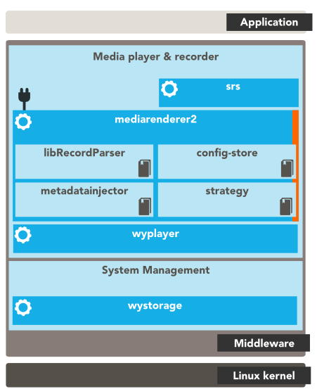 

[config-store](https://portal.frogbywyplay.com/docs/wytv/featured/components/system-config-store/overview/#config-store) : manage configuration through DBus or C++ API (content parameters, parental control, protection)

#####  WYPLAYER ([&#8632;](#0))
[WYPLAYER](https://portal.frogbywyplay.com/docs/wytv/featured/components/media-wyplayer/overview/): multimedia player responsible for rendering audio and video. ==See compatibility with supported stantards.==

#####  WYCAS ([&#8632;](#0))
[WYCAS](https://portal.frogbywyplay.com/docs/wytv/featured/components/media-libwycas/overview/) : built-in features to CAS integrators 
- filter PMT sections to descramble live DVD services 
- filter CAT sections to receive EMM sections

	/!\  limitations : i/ currently only work with unique CAS Driver ii/ no D-Bus interface for operator specific objects like purchases

###  2. MW-SYSTEM-MANAGEMENT ([&#8632;](#0))

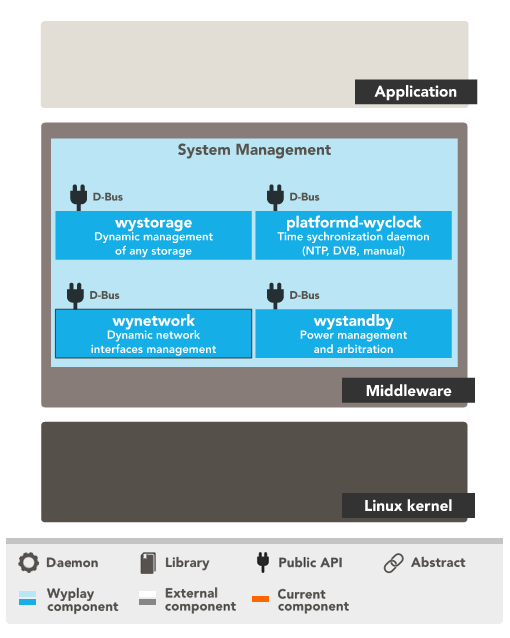 

#####  wystorage ([&#8632;](#0))
[wystorage](https://portal.frogbywyplay.com/docs/wytv/featured/components/system-wystorage/overview/) : mount disks/USB keys
#####  platformd-wyclock ([&#8632;](#0))
[platformd-wyclock](https://portal.frogbywyplay.com/docs/wytv/featured/components/system-platformd-wyclock/overview/) : time system
#####  network manager ([&#8632;](#0))
[network manager](https://portal.frogbywyplay.com/docs/wytv/featured/components/system-wynetwork/overview/) : network interface configuration, monitoring connections/disconnections, list available networks
#####  wystandby ([&#8632;](#0))
[wystandby](https://portal.frogbywyplay.com/docs/wytv/featured/components/system-wystandby/overview/) : manages the power state of the board (ready, standby, suspend, low-pwer, wake-up alarm)

###  3. MW-CONTENT-HANDLING ([&#8632;](#0))

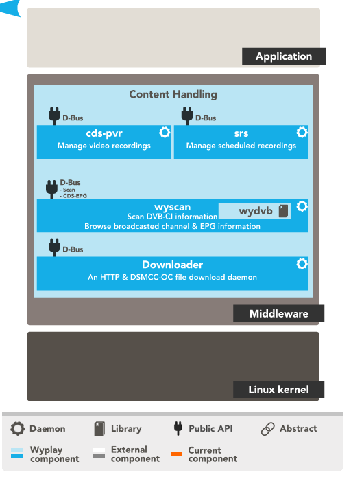 

#####  cds-pvr ([&#8632;](#0))
[cds-pvr](https://portal.frogbywyplay.com/docs/wytv/featured/components/contents-cds-pvr/overview/) : monitors the local list of recordings, which is populated by other components

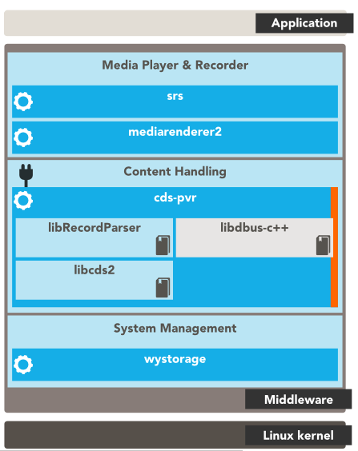 

#####  downloader ([&#8632;](#0))
[frogbywyplay.com](https://frogbywyplay.com/) 

#####  wyscan ([&#8632;](#0))
[wyscan](https://portal.frogbywyplay.com/docs/wytv/featured/components/contents-wyscan/overview/)

		-  framework enabling scan DVB transponders and retrieve the Service Information tables
		-  hosts cds-tv : services list ( includes fav. lists) and EPG
	/!\ you have to implement a plugin with yout product-specific scanning algorithm
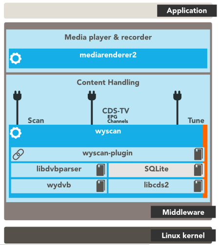 

###  4. MW-PLATFORM-ADAPTATION ([&#8632;](#0))
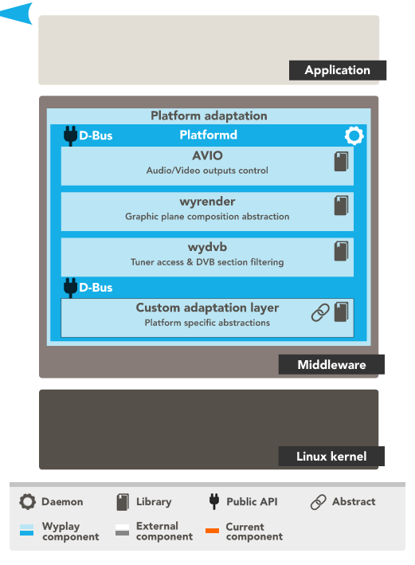 

#####  avio ([&#8632;](#0))
[avio](https://portal.frogbywyplay.com/docs/wytv/featured/devkit/components/porting-platformd-nexus-avio/overview/) : dead link

#####  wyrender ([&#8632;](#0))
[wyrender](https://portal.frogbywyplay.com/docs/wytv/featured/components/media-wyrender/overview/) : interface to be implemented in order to display frames : it allows hardware-specific graphical display operations

#####  wydvb ([&#8632;](#0)) 
[wydvb](https://portal.frogbywyplay.com/docs/wytv/featured/components/contents-wydvb/overview/) : manages DVB tuners of the Set-top box

###  5. MW-OTHER ([&#8632;](#0))
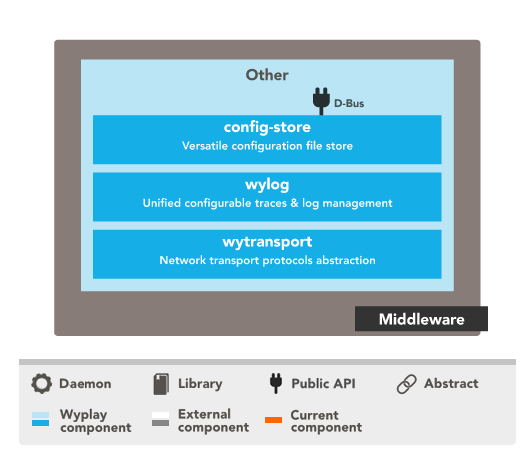 

#####  config-store ([&#8632;](#0))
[config-store](https://portal.frogbywyplay.com/docs/wytv/featured/components/system-config-store/overview/) : manages configuration for all components - through DBus or C++ APIs

#####  wylog ([&#8632;](#0))
[wylog](https://portal.frogbywyplay.com/docs/wytv/featured/components/utils-wylog/overview/) : library to manage component logs. Itis configurable.

#####  wytransport ([&#8632;](#0))
[wytransport](https://portal.frogbywyplay.com/docs/wytv/featured/components/utils-libwytransport/overview/) : gives access to multimedia content WITH PUGINS FOR TRANSPORT PROTOCOLS LIKE http, https, http/dlna, smb

