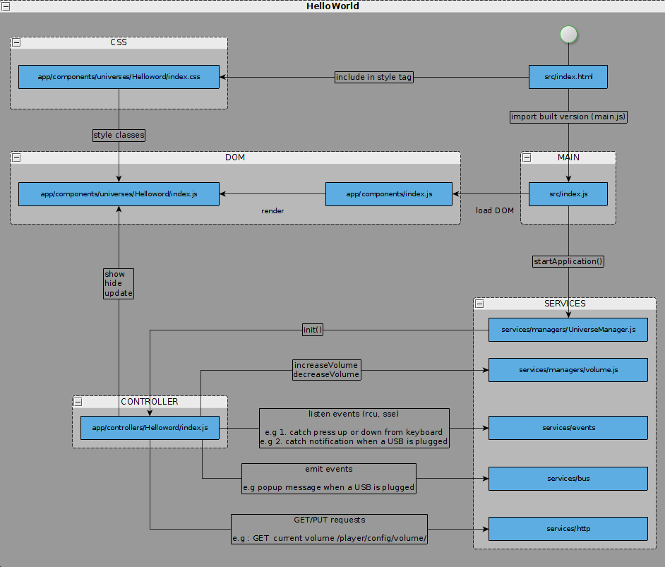

# <a name =0></a> Table of content
+ [Install](#1)
    + [Full development environment install](#2)
    + [Install on local computer](#3)
+ [Code](#4)
    + [Directory tree](#5)
    + [Code documentation](#6)
        + [Generate documentation](#7)
        + [Comments](#8)
+ [HelloWorld](#9)
    + [Overview](#10)
    + [Feature](#11)
    + [Steps](#12)
        + [a. Create Component](#13)
        + [b. Create Controller](#14)
        + [c. Add to Menu](#15)
+ [Feedback](#16)
+ [Glossary](#17)
      + [Technologies](#18)
      + [Libraries](#19)
# <a name ="1"></a> Install ([&#8632;](#0))
### <a name ="2"></a> Full development environment install ([&#8632;](#0))
[Full install guide](https://portal.frogbywyplay.com/docs/wytv/featured/guide-webapp-dev/dev-env-setup/)

[Prerequisites](https://portal.frogbywyplay.com/docs/wytv/featured/guide-webapp-dev/dev-env-setup/)
[Start UI from Set-Up-Box](https://portal.frogbywyplay.com/docs/wytv/featured/guide-webapp-dev/start-ui/)
[Debugging](https://portal.frogbywyplay.com/docs/wytv/featured/guide-webapp-dev/debug-testing/) : both on browser and remotely on STB embedded webkit browser
[REST-console ](https://portal.frogbywyplay.com/docs/wytv/featured/guide-webapp-dev/call-rest-api/) : to test request to server

### <a name ="3"></a> Install on local computer ([&#8632;](#0))
-  @feb 2017, no STB is installed, so we only use a computer running Linux, a browser and node

- download code

```
$ git clone git@github.com:frogbywyplay/apps_frog-ui.git
```

(prerequisite : open github account and access to source - ssh key)

- Install node and npm
```
$ sudo apt-get update
$ sudo apt-get install nodejs
$ sudo apt-get install npm
```

/!\ to resolve conflicting "node" use
```
$ sudo ln -s /usr/bin/nodejs /usr/local/bin/node
```
- cf. README from code :
Install node local environment 
```
$ npm install
```

Start the webpack-dev-server :

	$ npm start

Open the UI in your browser using the following URL: [http://0.0.0.0:8080/?stbIp=127.0.0.1&debug=true](http://0.0.0.0:8080/?stbIp=127.0.0.1&debug=true)

Live reload works great. Every change in ./src is recompliled and browser is reloaded automatically
See README for all available options or read [here](https://portal.frogbywyplay.com/docs/wytv/featured/guide-webapp-dev/start-ui/) 

- debug=true exposes main helpers (e.g : bus) in Chrome debug console
- Default setup are listed here "config.json". For project set-up, duplicate and rename "config.json" to "config.local.json". For quick/debug set-up on the fly, change query search options in the URL (flags need to be defined in app/config/index.js)

# <a name ="4"></a> Code ([&#8632;](#0))
### <a name ="5"></a> Directory tree ([&#8632;](#0))
Including brief description and doc links

RootDirectory
>
.
├── doc : *script to generate documentation*
├── script : *other scripts (e.g cli output)*
├── src : *ui js script*
├── test : *unit test code*
├── CHANGELOG : *log changes in different versions of code*
├── config.json : *default config, to be overrided by config.local.json*
├── config.webpack.json : *config for webpack server*
├── CONTRIBUTING.md
├── LICENSE
├── package.json : *list modules dependencies and available script*
├── README.md
└── webpack.config.babel.js : *config for module bundling*


Javascript sources
>
./src
├── app
├── locales : 
├── [services](#services)
├── [utils](#utils)
├── widgets
├── index.css
├── index.html
└── index.js

==App==
>
./src/app
├── assets
├── ==components==
├── config
├── controllers
├── models
└── utils

==Services==<a name="services"></a>
>
./src/services
├── api
│   ├── index.js
│   ├── scan.js
│   └── ...
├── managers
│   ├── index.js
│   ├── ScanManager.js
│   ├── ==UniverseManager.js==
│   ├── volume.js
│   └── ...
├── models
│   ├── channels
│   ├── ...
│   ├── index.js
│   ├── Subtitle.js
│   └── ...
├── [bus.js](https://portal.frogbywyplay.com/docs/wytv/featured/components/apps-frog-ui/framework/api-bus/)
├── [events.js](https://portal.frogbywyplay.com/docs/wytv/featured/components/apps-frog-ui/framework/api-events/) 
├── [http.js](https://portal.frogbywyplay.com/docs/wytv/featured/components/apps-frog-ui/framework/api-http/)
└── Model.js


/!\ Portal Frog documentation is outdated

==Widgets==
>
./src/widgets
├── list
├── [Component.js](https://portal.frogbywyplay.com/docs/wytv/featured/components/apps-frog-ui/framework/Component/)
└── index.js

==/!\ a word on how DOM is handled - components - philosophy - JSX - BEM==

Utils<a name="utils"></a>
[Link to doc]((https://portal.frogbywyplay.com/docs/wytv/featured/components/apps-frog-ui/framework/utils/))
>
./src/utils
├── CircularList.js
├── config.js
├── [Controller.js](https://portal.frogbywyplay.com/docs/wytv/featured/components/apps-frog-ui/framework/api-Controller/) 
├── date.js
├── dom.js
├── Singleton.js
├── string.js
└── ...

### <a name ="6"></a> Code documentation ([&#8632;](#0))
##### <a name ="7"></a> Generate documentation ([&#8632;](#0))
In project root :

```
$ npm run build-doc
```
Documentation will build here : [apps_frog-ui/esdoc/index.html]

##### <a name ="8"></a> Comments ([&#8632;](#0))

- /!\ HelloWorld tutorial is outdated. It does not match current code.
- 10% functions are commented 
- *Class*, *Functions* and *Variables* are listed here : [apps_frog-ui/esdoc/identifiers.html]

- *API webservices* are listed here : [apps_frog-ui/esdoc/source.html]

	(eg : volume.js service disposes of following webservices and REST calls : decreaseVolume, increaseVolume, getMute, mute, unmute)

- Implemented unit tests : [apps_frog-ui/esdoc/test.html]

- /!\ mocking request to API can be done using JS library [xhr-mock](https://github.com/jameslnewell/xhr-mock). List of all routes used in the frog-ui along with request and response samples are available [here](https://portal.frogbywyplay.com/docs/wytv/featured/components/appframeworks-wyrest/wyrest/http/routes/) 


# <a name ="9"></a> HelloWorld ([&#8632;](#0)) 
==TODO : Push new helloWorld code==
### <a name ="10"></a> Overview ([&#8632;](#0))
 

### <a name ="11"></a> Feature ([&#8632;](#0))
- display a new component when pressing OK from the remote/keyboard on the "helloworld" menu item (follow step a, b and c)
- display data by calling REST Api (cf. src/app/controllers/HelloWorld/index.js)
- display data SENT by the MiddleWare (cf. src/app/controllers/HelloWorld/index.js)

### <a name ="12"></a> Steps ([&#8632;](#0))
##### <a name ="13"></a> a. Create Component ([&#8632;](#0))
component : DOM unit used by the application to define both UI component (example : a button)and views (example: a side-bar)

	$ mkdir src/app/components/universes/HelloWorld
	$ touch src/app/components/universes/HelloWorld/index.js


style component

	$ touch src/app/components/universes/HelloWorld/index.css

add component to the "Application" main view defined in : src/app/components/index.js

- import component
- add component to DOM tree

##### <a name ="14"></a> b. Create Controller ([&#8632;](#0))
controller : listens to events (from MW, from Application via Bus, from Keyboard), update view, retrieve via service API

	$ mkdir src/app/controllers/HelloWorld/
	$ touch src/app/controllers/HelloWorld/index.js

controller needs to be referenced in main Manager defined in : src/app/services/managers/UniverseManager.js

##### <a name ="15"></a> c. Add to Menu ([&#8632;](#0))
add "Hello World" item to Home Menu in : src/app/models/Home.js


# <a name ="16"></a> Feedback ([&#8632;](#0))

- on-trend technologie, ahead of time (ES6, css-next)
- modular code
- maintainable code with coding rules (cf. file .eslintrc)
- MVC
- HelloWorld required some retro-engineering since code structure and architecture changed from what is documented

>**Conclusion : **
> code is generic enough, as well as documented and structured. Existing features works as good examples to developnew features.
> Adding new components using existing features is possible
> To pick up on the code, knowledge of Babel ES6 and webpack or likewise libraries is required

# <a name ="17"></a> Glossary ([&#8632;](#0))
#### <a name ="18"></a> Technologies ([&#8632;](#0))
Nodejs, npm, Javascript, HTML, CSS
[Babel](http://babeljs.io/) : Javascript compiler - allows the use of ECMAScript 6 [ECMAScript](https://en.wikipedia.org/wiki/ECMAScript). Compiler targets ECMAScript ES5 (supported by most browsers)
[Mocha](https://mochajs.org/) : unit test framework - handles async calls
[webpack](https://webpack.github.io/docs/what-is-webpack.html) : module bundler, build code in unique file main.js 

#### <a name ="19"></a> Libraries ([&#8632;](#0))

Library | Description
--- | --- 
css-loader, exports-loader, json-loader, style-loader, file-loader | chaque loader prend un fichier source et retourne la nouvelle source après la moulinette webpack
[eslint](https://www.npmjs.com/package/eslint) | JS lint*
[stylelint](https://www.npmjs.com/package/stylelint) | CSS lint*
[xhr-mock](https://github.com/jameslnewell/xhr-mock) | mock response to server request
[istanbul](https://github.com/gotwarlost/istanbul) | code coverage - Mocha dependency
[jsdom](https://github.com/tmpvar/jsdom) | mock DOM using JS - Mocha dependency
[postcss](http://postcss.org/) | compil [Css-next](http://cssnext.io/) (CSS form the future) in compatible CSS
[mixin](https://www.npmjs.com/package/mixin-js) | JS object tools
[array-flatten](https://github.com/blakeembrey/array-flatten) |  array tool
[sinon](https://www.npmjs.com/package/sinon) | test spies, stubs and mocks.

*lint : code checker (common mistakes, respect coding standards, codes rules)


