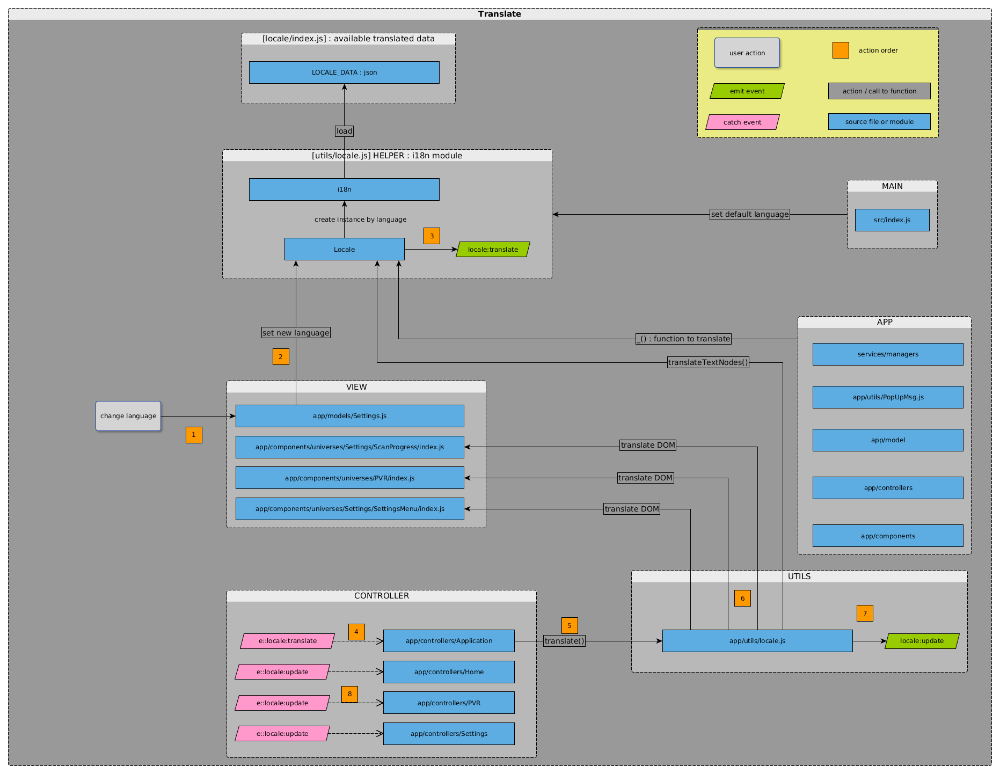

# Internationalisation

### How to

1. Change STB UI language :
via menu
menu settings already rendered are translated on the fly
```
/!\ do not change the language programmatically, it has to be done through the menu
```
>
a request PUT config/settings/locale is sent
Home menu are being reloaded

2. Handle a new language
>
Modify LOCALES variable in locale.sh
Run script to generate .po
Run script to update index.js

3. Add new text to be translated
Use the syntax :  _("text to be translated")

### Script generator "locale.sh"
- configure available languages
- create POT from JS source files in [apps_frog-ui/src] (cf. 1)
	
	/!\ add output args "-o" to define output file
	
- merge with POT added manually (cf. 1)
- create PO (cf. 1) :
run script for each new language (cf. 2)
previous existing PO files will be moved in a ~file.po
- create final JS file used by i18n module (cf. 4)

### Workflow
 


### Install

[Portal doc](https://portal.frogbywyplay.com/docs/wytv/featured/components/apps-frog-ui/framework/locale/) 

##### Prerequisites for locale.sh script to run

babel to extract translatable content from js files

	$ sudo apt-get install babel

python-babel python module for Babel

	$ sudo apt-get install python-babel

gettext to use msginit tool to create (*.po) translation files

	$ sudo apt-get install gettext

[locale-po to json](https://pypi.python.org/pypi/pojson) 

	$ sudo apt-get install python-pip
	$ sudo pip install pojson

##### Poedit : GNU for translators
[Online doc](https://poedit.net/) 

	$ sudo apt-get install poedit

### Code Implementation 
 


**locales/index.js** 
> LOCALE_DATA

**utils/locale.js**
>
*class i18n*
- load LOCALE_DATA and make translation available for a given translatable text 
	/!\ one instance per language
	
>
*class Locale*
	- creates an instance of i18n from LOCALE_DATA and the required language
	- offers functions to translate a given text or DOM tree nodes
	- sends an event once translating  via menu has been proceed

**app/utils/locale.js **
> translate DOM (SettingsMenu, manualRecord and ScanProgress-services-found) already loaded
send "locale:update" event after locale update


**_("translate me")**
syntax to translate a given text


### Translatable text references in the code 
>
- translation usage is not unified
- translatable string can be encapsulated in various data object and variables - they are not easy to identify
- string referenced manually in folder manual/*.pot don't point out their file source origin

### Comments
Messy

Not unified
> 
Source file should be referenced in manual POT
All translatable chain should have the same syntax _("...")

It is confusing to use the same script which results in different outcomes and output
>
Use 3 scripts instead : 
src_to_pot, pot_to_po (merge and add new languages), po_to_js


