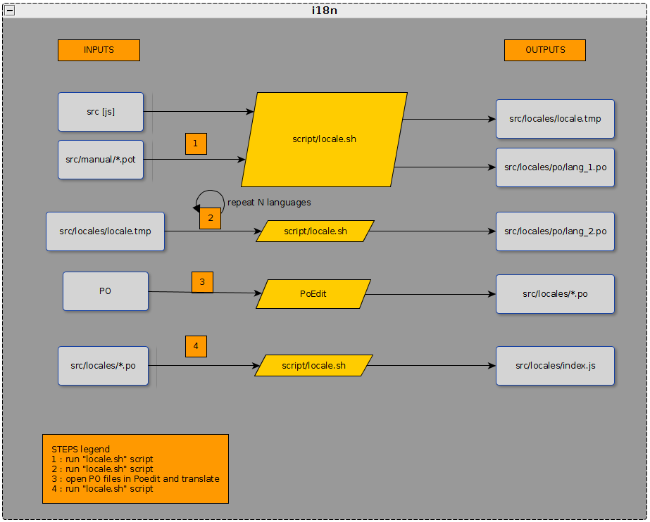
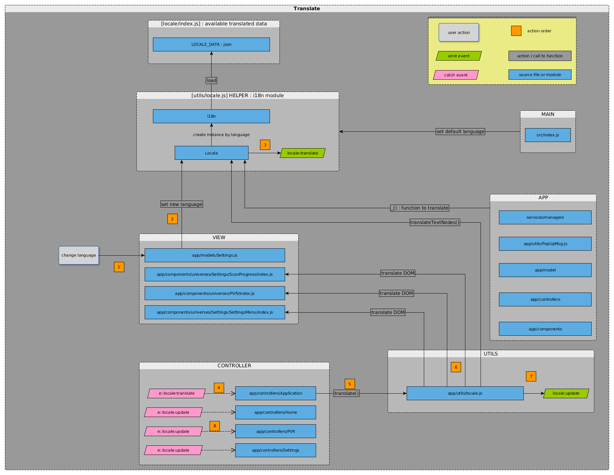

#  Table of content
+ [Internationalisation](#1)
    + [How to](#2)
    + [Script générateur "locale.sh"](#3)
    + [Workflow](#4)
    + [Installation](#5)
        + [Prerequisites for locale.sh script to run](#6)
        + [Poedit : GNU for translators](#7)
    + [Implémentation de l'internationalisation dans le code](#8)
    + [Référencement des chaînes à traduire : état actuel du code](#9)
    + [Commentaires](#10)
#  Internationalisation ([&#8632;](#0))

###  How to ([&#8632;](#0))

1. Changer la langue de l'interface :
via le menu
traduction à la volée des menus de configuration
/!\ atttention si changement de la langue via le code - ce n'est pas géré (faut passer par le menu)
>
requête PUT config/settings/locale
update de la Home

2. Ajouter une nouvelle langue à traduire
>
Modifier la variable LOCALES dans locale.sh
Lancer le script pour générer le .po
Lancer le script pour mettre à jour index.js

3. Rajouter des chaînes de caractères traductible

###  Script générateur "locale.sh" ([&#8632;](#0))
- configure available languages
- create POT from JS source files in [apps_frog-ui/src] (cf. 1)
	
	/!\ add output args "-o" to define output file
	
- merge with POT added manually (cf. 1)
- create PO (cf. 1) :
run script for each new language (cf. 2)
previous existing PO files will be moved in a ~file.po
- create final JS file used by i18n module (cf. 4)

###  Workflow ([&#8632;](#0))
 

###  Installation ([&#8632;](#0))

[Portal doc](https://portal.frogbywyplay.com/docs/wytv/featured/components/apps-frog-ui/framework/locale/) 

#####  Prerequisites for locale.sh script to run ([&#8632;](#0))

babel to extract translatable content from js files

	$ sudo apt-get install babel

python-babel python module for Babel

	$ sudo apt-get install python-babel

gettext to use msginit tool to create (*.po) translation files

	$ sudo apt-get install gettext

[locale-po to json](https://pypi.python.org/pypi/pojson) 

	$ sudo apt-get install python-pip
	$ sudo pip install pojson

#####  Poedit : GNU for translators ([&#8632;](#0))
[Online doc](https://poedit.net/) 

	$ sudo apt-get install poedit

###  Implémentation de l'internationalisation dans le code ([&#8632;](#0))
 

**locales/index.js** 
> LOCALE_DATA

**utils/locale.js**
>
*class i18n*
- charge les LOCALE_DATA et fournit la traduction d'une chaîne dans la langue
	/!\ autant d'instance que de langue
	
>
*class Locale*
	- instantie un i18n à partir des LOCALE_DATA et la langue demandée
	- fournit les fonctions de traduction d'une chaîne de caractère ou d'un ensemble d'élément du DOM
	- envoie un evenement lors d'un changement de langue via le menu

**app/utils/locale.js **
> translate DOM (SettingsMenu, manualRecord and ScanProgress-services-found) already loaded
envoie un event après traduction "locale:update"

**_("translate me")**
appelée dans tout le code pour traduite

###  Référencement des chaînes à traduire : état actuel du code ([&#8632;](#0))
> 
- pas unifié
- Il faut identifier les chaînes qui sont à traduire, elles peuvent être encapsulées dans différentes structure de données ou variables (e.g : items.label, attributes.comment.default)
- Les chaînes répertoriées manuellement dans manual/*.pot ne précisent pas le référencement au fichier source

###  Commentaires ([&#8632;](#0))
Un joyeux bazar

pas unifié
> 
Référencer au moins les noms de fichier dans les POT manuel et préfixer TOUTES les chaînes à traduire par _("")

même script à lancer plusieurs fois et qui va faire des actions différentes à chaque fois)
>
Découper le script : 
src_to_pot, pot_to_po (merge and add new languages), po_to_js

